# Stockpile - Inventory Management System

A full-stack CRUD inventory management system: products, categories, stock
movements with a full audit trail, JWT authentication and role-based access,
behind a documented REST API.

Built with **Next.js 16** (App Router) and **Neon Postgres**.

| | |
| --- | --- |
| Live API reference | `/api-docs` (rendered from [`public/openapi.json`](public/openapi.json)) |
| Postman collection | [`docs/Stockpile.postman_collection.json`](docs/Stockpile.postman_collection.json) - 27 requests, 23 assertions |
| Demo accounts | `admin@stockpile.dev` / `staff@stockpile.dev`, password `Password123!` |

## Screenshots

| Dashboard | Products |
| --- | --- |
| 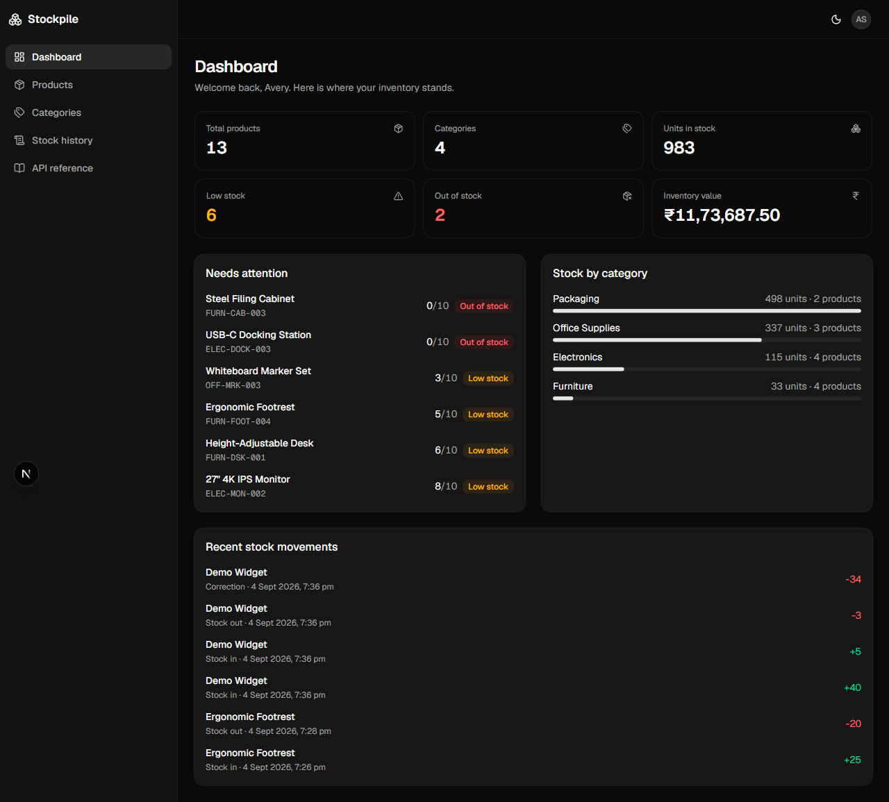 | 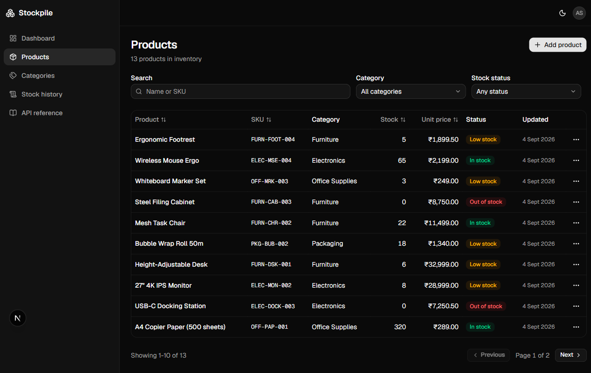 |

| Product detail with QR code | Add product |
| --- | --- |
| 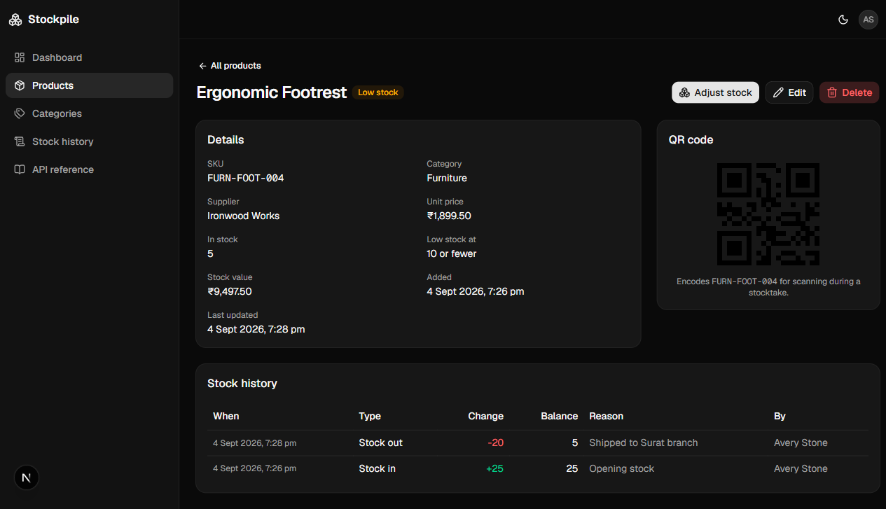 | 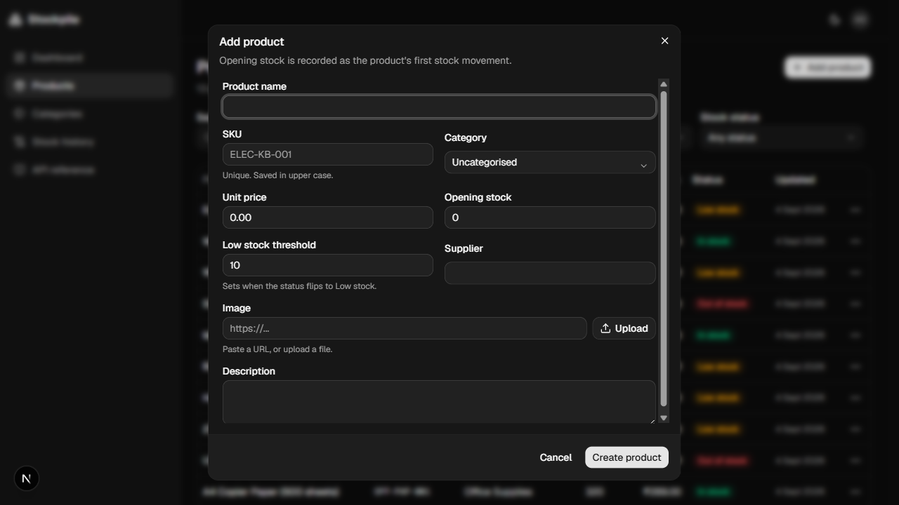 |

| Stock adjustment | Categories |
| --- | --- |
| 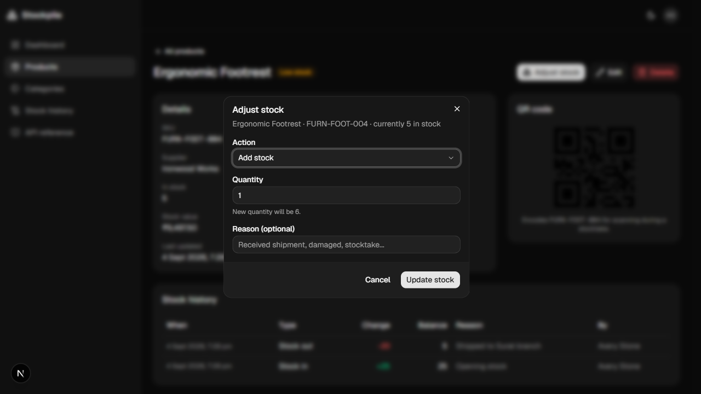 | 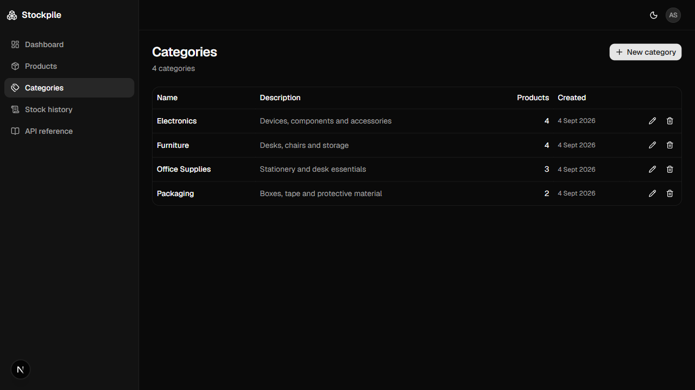 |

| Stock history | Sign in |
| --- | --- |
| 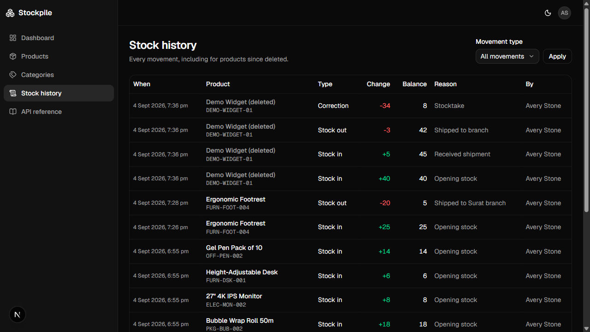 | 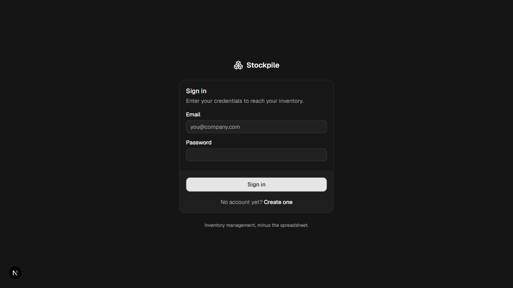 |

| Mobile | API reference |
| --- | --- |
| 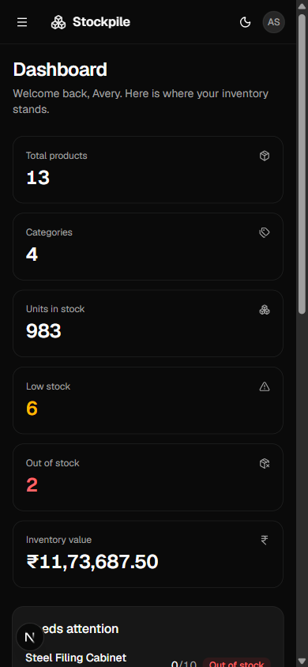 | 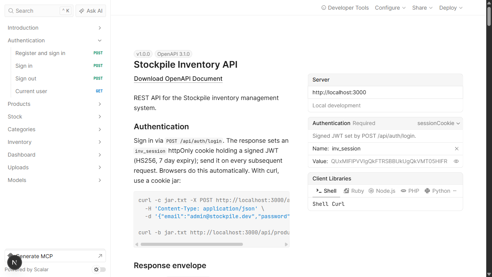 |

## Stack

| Layer | Choice | Why not the alternative |
| --- | --- | --- |
| Framework | Next.js 16, App Router, Route Handlers as the REST API | A separate Express server means two deploys and two auth stories for no gain |
| Database | Neon Postgres, `neon-serverless` WebSocket driver | The `neon-http` driver cannot run interactive transactions, and stock movements need one |
| ORM / migrations | Drizzle ORM + drizzle-kit | Prisma adds an engine and a codegen step; raw SQL gives up migrations and types |
| Auth | `jose` JWT (HS256) in an httpOnly cookie, `bcryptjs` hashing | Auth.js is a large dependency for email + password, and the auth is the thing being assessed |
| Validation | Zod, one schema per request, shared by the API and the forms | Separate client and server rules drift apart |
| List state | URL search params | Redux/Zustand for state the URL already holds, losing shareable links and the back button |
| UI | Tailwind CSS v4, shadcn/ui, `sonner` toasts, `next-themes` dark mode | A component library that cannot be edited in place |
| Tests | Vitest, split into offline unit and real-database integration suites | - |

## Architecture

The assignment wants a documented REST API *and* a good frontend. The trap is
building both and having the UI bypass the API (the API becomes decoration), or
having Server Components `fetch()` the app's own endpoints over HTTP (a request
from a server to itself). A shared service layer avoids both:

```text
   UI: Server Components (reads) + client forms (writes)
        |                                  |
        | direct call, no HTTP hop         | fetch()
        |                                  v
        |                     src/app/api/**/route.ts
        |                     thin: parse with Zod -> call service ->
        |                     map failures to status codes
        v                                  v
        src/lib/services/*   <-- every business rule, exactly once
                     |
                     v
        Drizzle ORM -> Neon Postgres
```

Every rule has one implementation. The REST API is complete and genuinely
exercised (the Postman collection drives the same code the app uses), reads
still render on the server, and nothing fetches itself.

`src/proxy.ts` (Next.js 16's replacement for `middleware.ts`) only *routes*
visitors: anonymous users hitting a protected page are sent to `/login`.
Authorisation is enforced inside every handler by `requireUser()` /
`requireAdmin()`, so a proxy bypass cannot expose data.

### Folder structure

```text
src/
  app/
    (auth)/login, (auth)/register    Public pages
    (app)/dashboard, products,       Signed-in shell: sidebar, theme, user menu
          products/[id], categories,
          inventory
    api/auth, products, categories,  REST route handlers
        inventory, dashboard, uploads
    api-docs/                        Renders public/openapi.json
  components/
    ui/                              shadcn primitives, owned in-repo
    products/, categories/, shell/   Feature components
  db/
    schema.ts, index.ts, seed.ts     Drizzle schema, pooled client, seed
  lib/
    services/                        All business logic
    validation/                      Zod schemas, shared client and server
    api.ts, errors.ts, auth.ts,      HTTP mapping, error type, session
    session.ts, password.ts
  proxy.ts                           Page routing for anonymous visitors
drizzle/                             Generated SQL migrations
```

## Setup

Requires Node.js 20 or newer (developed on 24) and a Neon account.

### 1. Install dependencies

```bash
npm install
```

### 2. Create a Neon database

Use the dashboard at <https://console.neon.tech> and copy the **pooled**
connection string (its host contains `-pooler`), or the CLI:

```bash
npx neonctl auth
npx neonctl projects create --name stockpile
npx neonctl connection-string --pooled
```

### 3. Configure the environment

```bash
cp .env.example .env
```

Set `DATABASE_URL` to the pooled connection string, then generate a signing key:

```bash
node -e "console.log(require('crypto').randomBytes(32).toString('hex'))"
```

Put that in `JWT_SECRET`. Both are validated at boot, so a missing or too-short
value fails with a named error rather than a confusing driver exception.

`BLOB_READ_WRITE_TOKEN` is optional and only enables direct image *upload*; the
product form always accepts an image URL, and the upload endpoint returns a
clear `501` when it is unset.

### 4. Create the schema and seed it

```bash
npm run db:migrate
npm run db:seed
```

The seed is idempotent and creates two users, four categories and twelve
products whose quantities deliberately straddle the thresholds, so all three
stock states are visible immediately.

### 5. Run it

```bash
npm run dev
```

Open <http://localhost:3000> and sign in with `admin@stockpile.dev` /
`Password123!`.

| Account | Role | Can |
| --- | --- | --- |
| `admin@stockpile.dev` | admin | Everything, including deleting products and categories |
| `staff@stockpile.dev` | staff | Everything except deletes (`403`) |

## Scripts

| Command | Purpose |
| --- | --- |
| `npm run dev` | Development server |
| `npm run build` / `npm start` | Production build and serve |
| `npm run verify` | Typecheck, lint, unit tests and build - the one command that proves the tree is sound |
| `npm run typecheck` | `next typegen` then `tsc --noEmit` |
| `npm run lint` | ESLint |
| `npm test` | Unit tests. Offline, no database needed |
| `npm run test:db` | Integration tests against the real database |
| `npm run db:generate` | Generate a migration from `src/db/schema.ts` |
| `npm run db:migrate` | Apply pending migrations |
| `npm run db:seed` | Seed sample data (skips if users already exist) |
| `npm run db:studio` | Drizzle Studio |

## Database design

Four normalised tables.

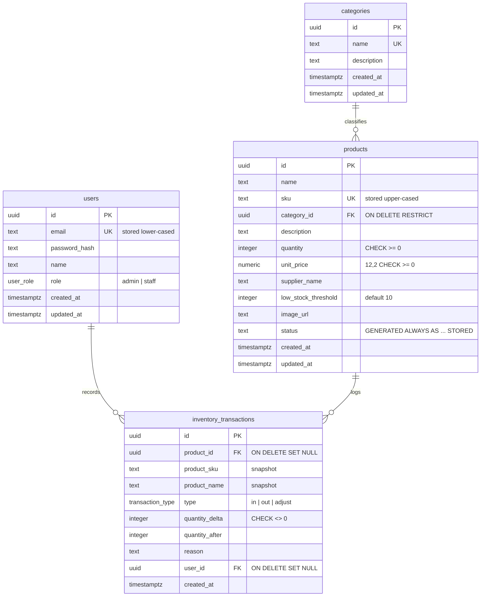

The full DDL is in [`drizzle/0000_burly_pride.sql`](drizzle/0000_burly_pride.sql).

### Three rules enforced by Postgres, not by application code

**Stock status is a generated column.** The assignment lists `status` as a
product field *and* asks for it to follow quantity automatically. Doing that in
application code means every write path has to remember; doing it in the
database means it cannot be forgotten:

```sql
status text GENERATED ALWAYS AS (
  CASE WHEN quantity <= 0                   THEN 'out_of_stock'
       WHEN quantity <= low_stock_threshold THEN 'low_stock'
       ELSE                                      'in_stock' END
) STORED
```

It cannot drift from `quantity`, it is indexed so `?status=low_stock` is an
index scan, the dashboard counts become one `FILTER` aggregate, and Postgres
rejects any attempt to write it directly (`428C9`) - so a client cannot spoof a
product's status.

**Negative stock is impossible.** `CHECK (quantity >= 0)`, combined with
applying movements as `quantity = quantity + delta` in SQL. An
application-level read-then-check would let two concurrent stock-outs both pass
a stale check; the constraint cannot be raced, and surfaces as a `422`.

**Uniqueness is the index.** `products.sku`, `categories.name` and
`users.email` have unique indexes. A pre-flight `SELECT` would be slower *and*
racy, so the Postgres error is caught and mapped to a `409` naming the field.
The same foreign key is mapped to two different messages depending on which end
failed: `23503` (a product referencing a missing category) versus `23001` (a
category that still has products).

The one deliberate denormalisation: `inventory_transactions` snapshots the
product's SKU and name, so the audit trail stays readable after a product is
deleted. Audit rows are meant to be immutable.

## API

Full interactive reference at `/api-docs`; the spec is
[`public/openapi.json`](public/openapi.json).

| Method | Route | Notes |
| --- | --- | --- |
| `POST` | `/api/auth/register` | Creates a user and signs them in |
| `POST` | `/api/auth/login` · `/api/auth/logout` | Sets / clears the session cookie |
| `GET` | `/api/auth/me` | Current user; `401` when anonymous |
| `GET` | `/api/products` | `?q=&category=&status=&sort=&order=&page=&limit=` |
| `POST` | `/api/products` | Opening stock is recorded as the first movement |
| `GET` `PATCH` `DELETE` | `/api/products/{id}` | `DELETE` is admin-only |
| `POST` | `/api/products/{id}/stock` | `{delta}` relative, or `{quantity}` absolute |
| `GET` `POST` | `/api/categories` | List includes `productCount` |
| `GET` `PATCH` `DELETE` | `/api/categories/{id}` | `DELETE` admin-only; `409` while in use |
| `GET` | `/api/inventory/transactions` | `?productId=&type=&page=&limit=` |
| `GET` | `/api/dashboard` | The five overview counts plus inventory value |
| `POST` | `/api/uploads` | Product image; `501` when no blob store is configured |

Success is `{ "data": ... }`, with `{ "meta": ... }` added by list endpoints.
Errors are `{ "error": { "message", "code", "fields"? } }`, where `fields` maps
a form field to a message so the client can render it inline. Status codes used:
`200` `201` `400` `401` `403` `404` `409` `422` `501` `500`.

## Testing

Two suites, split by what they need:

```bash
npm test        # 17 unit tests, offline
npm run test:db # 16 integration tests, real Postgres
```

- **Unit** - token signing and tampering, email normalisation, and the HTTP
  error mapping. No database, so it runs anywhere including CI.
- **Integration** - the guarantees Postgres enforces, including the boundary
  cases: a decrement landing exactly on zero, a zero threshold at zero stock,
  and the fact that writing `status` directly is rejected. Mocking these would
  only prove the mock agrees with itself. Fixtures are namespaced (`ITEST-`
  SKUs) and cleaned up afterwards.

The error-mapping tests deliberately use Drizzle's real error shape. Drizzle
wraps driver errors and puts the SQLSTATE on `cause`, so a fixture built as a
bare `{ code }` object let the mapping pass in tests while returning `500` in
production - which is exactly what happened before the integration suite
existed.

The API is additionally covered end to end by the Postman collection:

```bash
npx newman run docs/Stockpile.postman_collection.json
# 27 requests, 23 assertions, 0 failures
```

## Assumptions and trade-offs

- **One shared, company-wide inventory**, not an inventory per user. Roles gate
  destructive actions. An inventory system describes a business's stock, not a
  user's private list. Per-tenant scoping would mean an `organisation_id` on
  every table.
- **Stock cannot be changed by `PATCH /api/products/{id}`.** It moves only
  through the stock endpoint, so every change leaves an audit row. A `PATCH`
  that could set `quantity` would be a hole in the trail.
- **Money is `numeric(12,2)`**, exchanged as a string, so no binary rounding
  error accumulates. The UI formats it for display. Currency is hard-coded to
  INR in `src/lib/format.ts`.
- **Product search is `ILIKE '%term%'`**, a sequential scan. Correct and simple
  at this size; the upgrade path (a `pg_trgm` GIN index) is noted in
  `src/db/schema.ts` rather than built speculatively.
- **Deleting a category is refused while products reference it** rather than
  orphaning or cascading, because silently deleting stock is worse than an
  error message.
- **Dropdowns are native `<select>`.** Keyboard accessible for free, uses the
  OS picker on mobile, and ships no client JavaScript.
- **Sorting, filtering and paging are links and URL params**, so a filtered
  view is shareable and the back button undoes a filter.
- **No Docker.** Neon is hosted, so a Dockerfile nobody runs would be dead
  weight. Deployment target is Vercel + Neon.
- **Not built:** CSV import/export and dashboard charts (a CSS bar list covers
  the category breakdown without a charting dependency).

## Deployment

Deploys to Vercel unchanged. Set `DATABASE_URL` and `JWT_SECRET` (and
optionally `BLOB_READ_WRITE_TOKEN`) as environment variables, then run
`npm run db:migrate` against the production database once. Environment
variables are validated at build time, so a missing one fails the build rather
than the first request.
